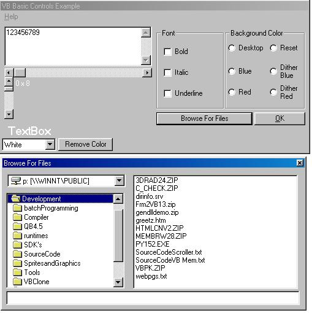



## Basic VB Controls

### Description

Getting back to the basics of using VB6 controls. Included in the project are, checkboxes, options, combobox, textbox, Scroll bars, File list, Dir list, and drive list. Very simple programming intended for beginners. Has an example of browsing for files without using common dialog control. Plus an example of using the ShellExecute api and 2 option dithered background.

I hope the code is helpful to those that are new. I'm sure there are others like this on here.
 
### More Info
 

             |
---                |---
**Submitted On**   |2002-10-14 11:33:48
**By**             |[Michael Heath](https://github.com/Planet-Source-Code/PSCIndex/blob/master/ByAuthor/michael-heath.md)
**Level**          |Beginner
**User Rating**    |4.6 (46 globes from 10 users)
**Compatibility**  |VB 3\.0, VB 4\.0 \(16\-bit\), VB 4\.0 \(32\-bit\), VB 5\.0, VB 6\.0, VB Script, ASP \(Active Server Pages\) 
**Category**       |[Files/ File Controls/ Input/ Output](https://github.com/Planet-Source-Code/PSCIndex/blob/master/ByCategory/files-file-controls-input-output__1-3.md)
**World**          |[Visual Basic](https://github.com/Planet-Source-Code/PSCIndex/blob/master/ByWorld/visual-basic.md)
**Archive File**   |[Basic\_VB\_C14598810142002\.zip](https://github.com/Planet-Source-Code/michael-heath-basic-vb-controls__1-9539/archive/master.zip)

